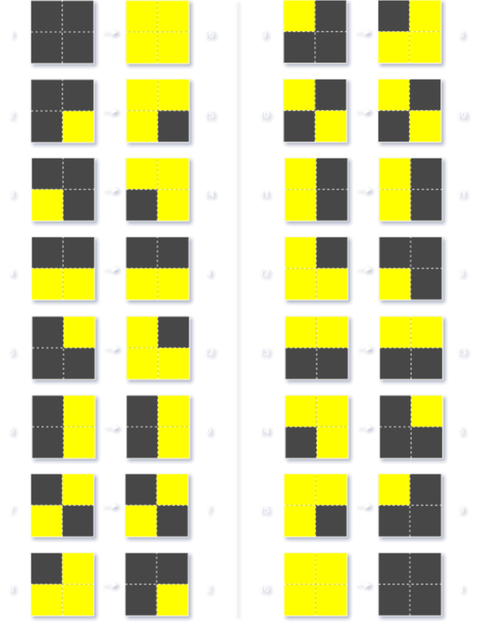

# Critters

Critters Cellular Automaton.[^1]

<!--TODO: video of a fun critter-->

Critters is a reversible block [cellular automaton](https://en.wikipedia.org/wiki/Cellular_automaton). It is similar to Conway's Game of Life (GoL), GoL, however, is not reversible.[^2][^3] The specific [ruleset](#rules) allow it to create many patterns similar to GoL's [gliders](https://en.wikipedia.org/wiki/Glider_(Conway%27s_Game_of_Life)). It allows for many, more complex, [spaceships](https://en.wikipedia.org/wiki/Spaceship_(cellular_automaton)) and [oscillators](https://en.wikipedia.org/wiki/Oscillator_(cellular_automaton)).

Although this project's main focus is on simulating Critters, it also includes other automata, such as the Game of Life.

## Prerequisites

Before installing this application and using it, you will need the following software:

- [GNU Octave](https://octave.org/download) (This must also be added to `PATH`).

## Installation

Clone the repository `git clone git@github.com:Dunc4nNT/critters.git`.

You can now `cd` into the `citters/src` folder, wherefrom you can launch the app `octave main.m`.

That's it, you can now play Critters!

## Usage

<!--TODO: once the GUI is finished, add a section here with images explaining how to use the app-->

## Ruleset

Critters has a 2D grid with two states, dead and alive. Critters rule uses the Margolus neighbourhood, which, at every generation alternates between 2x2 blocks. The center of a block at one generation, becomes corner to four blocks the next.[^4]

The transition rule for Critters counts how many cells in a block are alive. If the number of alive cells is exactly two, the cells in the block remain unchanged. If there are zero, one, or four cells alive, the state of every cell flips, so alive cells become dead, and dead cells become alive. Finally, in the case three cells are alive, the cells' states flip and the block is rotated 180°. All possible combinations can be seen in the figure below.

\
All possible 2x2 block transformations in the Critters ruleset.

Due to the nature of the transformations, the rule leads to a lot of screen flickering as most cells swap state every generation. As this is not pleasant nor useful, this implementation, like many others, inverts the colours every other generation. This means there won't be any screen flickering, but it does mean that every odd generation has alive cells swapped for dead and vice versa.

## Licensing

Copyright © 2025 Dunc4nNT

This repository is licensed under the Mozilla Public License 2.0 (MPL 2.0). See [LICENSE](./LICENSE) for more information.

<!--References-->

[^1]: Wikipedia contributors, “Critters (cellular automaton),” Wikipedia, Apr. 28, 2022. https://en.wikipedia.org/wiki/Critters_(cellular_automaton)
[^2]: Wikipedia contributors, “Conway’s game of life,” Wikipedia, May 19, 2025. https://en.wikipedia.org/wiki/Conway%27s_Game_of_Life
[^3]: edwin@bitstorm.org, “Play John Conway’s game of life.” https://playgameoflife.com/
[^4]: “Cellular Automata - The Margolus neighbourhood.” https://cell-auto.com/neighbourhood/margolus/
